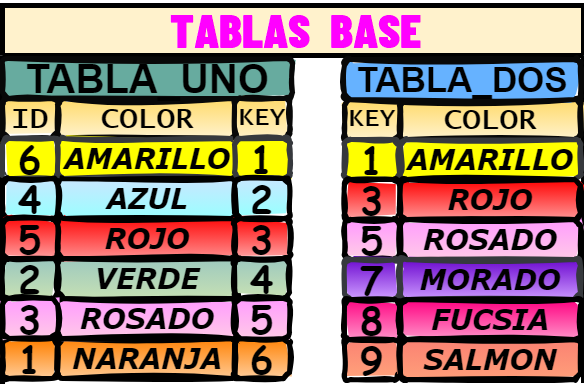

# <center> MONGO DB JOINS <center>
<p align="center">
  
</p>

# INNER JOIN
```mongodb
const fieldMapping = {
    _id_tabla_uno: '$_id',
    id_tabla_uno: '$id',
    color_tabla_uno: '$color',
    key_tabla_uno: '$key',
    _id_tabla_dos: '$joinedData._id',
    key_tabla_dos: '$joinedData.key',
    color_tabla_dos: '$joinedData.color'
};

const projection = {
    $project: {}
};

Object.keys(fieldMapping).forEach(key => {
    projection.$project[key] = fieldMapping[key];
});

db.tabla_uno.aggregate([
    {
        $lookup: {
            from: "tabla_dos",
            localField: "key",
            foreignField: "key",
            as: "joinedData"
        }
    },
    {
        $unwind: {
            path: "$joinedData",
            preserveNullAndEmptyArrays: false
        }
    },
    projection
]);
```

# LEFT JOIN
```mongodb
const fieldMapping = {
    _id_tabla_uno: '$_id',
    id_tabla_uno: '$id',
    color_tabla_uno: '$color',
    key_tabla_uno: '$key',
    _id_tabla_dos: '$joinedData._id',
    key_tabla_dos: '$joinedData.key',
    color_tabla_dos: '$joinedData.color'
};

const projection = {
    $project: {}
};

Object.keys(fieldMapping).forEach(key => {
    const field = fieldMapping[key];
    projection.$project[key] = {
        $ifNull: [field, null]
    };
});

db.tabla_uno.aggregate([
    {
        $lookup: {
            from: "tabla_dos",
            localField: "key",
            foreignField: "key",
            as: "joinedData"
        }
    },
    {
        $unwind: {
            path: "$joinedData",
            preserveNullAndEmptyArrays: true
        }
    },
    projection
]);
```

# ANTI LEFT JOIN
```mongodb
const fieldMapping = {
    _id_tabla_uno: '$_id',
    id_tabla_uno: '$id',
    color_tabla_uno: '$color',
    key_tabla_uno: '$key',
    _id_tabla_dos: null,
    key_tabla_dos: null,
    color_tabla_dos: null
};

const projection = {
    $project: {}
};

Object.keys(fieldMapping).forEach(key => {
    const field = fieldMapping[key];
    projection.$project[key] = {
        $ifNull: [field, null]
    };
});

db.tabla_uno.aggregate([
    {
        $lookup: {
            from: "tabla_dos",
            localField: "key",
            foreignField: "key",
            as: "joinedData"
        }
    },
    {
        $addFields: {
            noMatch: { $eq: ["$joinedData", []] }
        }
    },
    {
        $match: {
            noMatch: true // Filtrar solo los documentos sin coincidencias
        }
    },
    projection
]);
```


# RIGHT JOIN
```mongodb
const fieldMapping = {
    _id_tabla_uno: '$joinedData._id',
    id_tabla_uno: '$joinedData.id',
    color_tabla_uno: '$joinedData.color',
    key_tabla_uno: '$joinedData.key',
    _id_tabla_dos: '$_id',
    key_tabla_dos: '$key',
    color_tabla_dos: '$color'
};

const projection = {
    $project: {}
};

Object.keys(fieldMapping).forEach(key => {
    const field = fieldMapping[key];
    projection.$project[key] = {
        $ifNull: [field, null]
    };
});

db.tabla_dos.aggregate([
    {
        $lookup: {
            from: "tabla_uno",
            localField: "key",
            foreignField: "key",
            as: "joinedData"
        }
    },
    {
        $unwind: {
            path: "$joinedData",
            preserveNullAndEmptyArrays: true
        }
    },
    projection
]);
```


# ANTI RIGHT JOIN
```mongodb
const fieldMapping = {
    _id_tabla_uno: null,
    id_tabla_uno: null,
    color_tabla_uno: null,
    key_tabla_uno: null,
    _id_tabla_dos: '$_id',
    key_tabla_dos: '$key',
    color_tabla_dos: '$color'
};

const projection = {
    $project: {}
};

Object.keys(fieldMapping).forEach(key => {
    const field = fieldMapping[key];
    projection.$project[key] = {
        $ifNull: [field, null]
    };
});

db.tabla_dos.aggregate([
    {
        $lookup: {
            from: "tabla_uno",
            localField: "key",
            foreignField: "key",
            as: "joinedData"
        }
    },
    {
        $match: {
            joinedData: { $eq: [] } // Filtrar solo los documentos sin coincidencias
        }
    },
    projection
]);
```


# FULL JOIN
```mongodb
const leftJoinPipeline = [
    {
        $lookup: {
            from: "tabla_dos",
            localField: "key",
            foreignField: "key",
            as: "leftJoinedData"
        }
    },
    {
        $unwind: {
            path: "$leftJoinedData",
            preserveNullAndEmptyArrays: true
        }
    },
    {
        $project: {
            _id_tabla_uno: "$_id",
            id_tabla_uno: "$id",
            color_tabla_uno: "$color",
            key_tabla_uno: "$key",
            _id_tabla_dos: { $ifNull: ["$leftJoinedData._id", null] },
            key_tabla_dos: { $ifNull: ["$leftJoinedData.key", null] },
            color_tabla_dos: { $ifNull: ["$leftJoinedData.color", null] }
        }
    }
];

const rightJoinPipeline = [
    {
        $lookup: {
            from: "tabla_uno",
            localField: "key",
            foreignField: "key",
            as: "rightJoinedData"
        }
    },
    {
        $unwind: {
            path: "$rightJoinedData",
            preserveNullAndEmptyArrays: true
        }
    },
    {
        $project: {
            _id_tabla_uno: { $ifNull: ["$rightJoinedData._id", null] },
            id_tabla_uno: { $ifNull: ["$rightJoinedData.id", null] },
            color_tabla_uno: { $ifNull: ["$rightJoinedData.color", null] },
            key_tabla_uno: { $ifNull: ["$rightJoinedData.key", null] },
            _id_tabla_dos: "$_id",
            key_tabla_dos: "$key",
            color_tabla_dos: "$color"
        }
    }
];

// Ejecuta el LEFT JOIN y el RIGHT JOIN
const leftJoin = db.tabla_uno.aggregate(leftJoinPipeline).toArray();
const rightJoin = db.tabla_dos.aggregate(rightJoinPipeline).toArray();

// Combina los resultados del LEFT JOIN y RIGHT JOIN para obtener el FULL JOIN
const fullJoinResult = leftJoin.concat(rightJoin);

// Muestra o utiliza los resultados del FULL JOIN según sea necesario
printjson(fullJoinResult);
```

# ANTI FULL JOIN
```mongodb
// Realiza el Antileft Join
const antileftJoin = db.tabla_uno.aggregate([
    {
        $lookup: {
            from: "tabla_dos",
            localField: "key",
            foreignField: "key",
            as: "joinedData"
        }
    },
    {
        $addFields: {
            noMatch: { $eq: ["$joinedData", []] }
        }
    },
    {
        $match: {
            noMatch: true // Filtrar solo los documentos sin coincidencias
        }
    },
    {
        $project: {
            _id_tabla_uno: "$_id",
            id_tabla_uno: "$id",
            color_tabla_uno: "$color",
            key_tabla_uno: "$key",
            _id_tabla_dos: null,
            key_tabla_dos: null,
            color_tabla_dos: null
        }
    }
]);

// Realiza el Antiright Join
const antirightJoin = db.tabla_dos.aggregate([
    {
        $lookup: {
            from: "tabla_uno",
            localField: "key",
            foreignField: "key",
            as: "joinedData"
        }
    },
    {
        $match: {
            joinedData: { $eq: [] } // Filtrar solo los documentos sin coincidencias
        }
    },
    {
        $project: {
            _id_tabla_uno: null,
            id_tabla_uno: null,
            color_tabla_uno: null,
            key_tabla_uno: null,
            _id_tabla_dos: "$_id",
            key_tabla_dos: "$key",
            color_tabla_dos: "$color"
        }
    }
]);

// Combina los resultados del Antileft Join y Antiright Join para obtener el Anti FULL JOIN
const antiFullJoinResult = antileftJoin.toArray().concat(antirightJoin.toArray());

// Muestra o utiliza los resultados del Anti FULL JOIN según sea necesario
printjson(antiFullJoinResult);
```

# CROSS JOIN
```mongodb
db.tabla_uno.aggregate([
  {
    $lookup: {
      from: "tabla_dos",
      let: {},
      pipeline: [{ $match: {} }],
      as: "crossJoinResult"
    }
  },
  {
    $unwind: {
      path: "$crossJoinResult",
      preserveNullAndEmptyArrays: true
    }
  },
  {
    $project: {
      _id_tabla_uno: "$_id",
      id_tabla_uno: "$id",
      color_tabla_uno: "$color",
      key_tabla_uno: "$key",
      _id_tabla_dos: "$crossJoinResult._id",
      key_tabla_dos: "$crossJoinResult.key",
      color_tabla_dos: "$crossJoinResult.color"
    }
  }
]);
```

# SELF JOIN
```mongodb
db.tabla_uno.aggregate([
  {
    $lookup: {
      from: "tabla_uno",
      let: { key: "$key" },
      pipeline: [
        {
          $match: {
            $expr: { $eq: ["$$key", "$id"] }
          }
        },
        {
          $project: {
            _id_self_join: "$_id",
            id_self_join: "$id",
            color_self_join: "$color",
            key_self_join: "$key"
          }
        }
      ],
      as: "joinedData"
    }
  },
  {
    $unwind: "$joinedData" // Desenrolla el array creado por $lookup
  },
  {
    $project: {
      _id_tabla_uno: "$_id",
      id_tabla_uno: "$id",
      color_tabla_uno: "$color",
      key_tabla_uno: "$key",
      _id_self_join: "$joinedData._id_self_join",
      id_self_join: "$joinedData.id_self_join",
      color_self_join: "$joinedData.color_self_join",
      key_self_join: "$joinedData.key_self_join"
    }
  }
]);
```

# UNION
```mongodb

```

# UNION ALL
```mongodb
db.tabla_uno.aggregate([
  {
    $project: {
      _id_tabla_uno: "$_id",
      id_tabla_uno: "$id",
      color_tabla_uno: "$color",
      key_tabla_uno: "$key",
      collection: { $literal: "tabla_uno" }
    }
  },
  {
    $unionWith: {
      coll: "tabla_dos",
      pipeline: [
        {
          $project: {
            _id_tabla_dos: "$_id",
            id_tabla_dos: "$id",
            color_tabla_dos: "$color",
            key_tabla_dos: "$key",
            collection: { $literal: "tabla_dos" }
          }
        }
      ]
    }
  }
]);
```